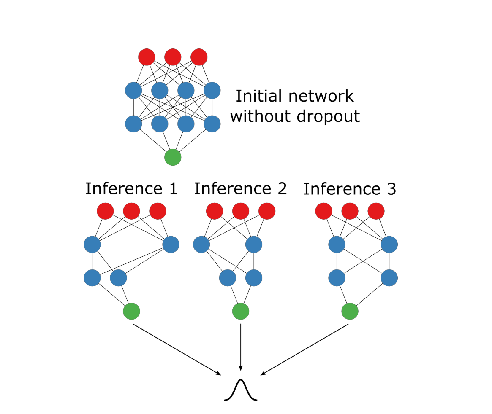
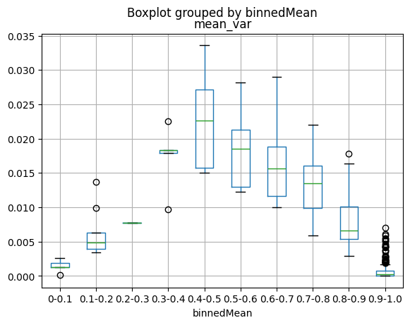
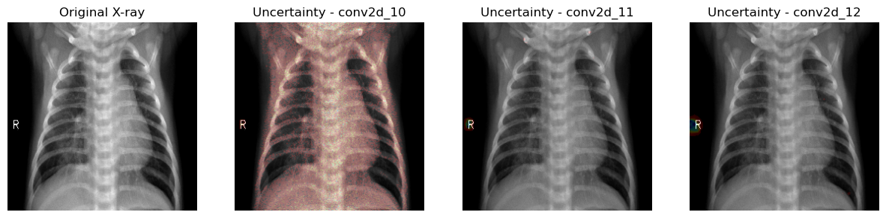
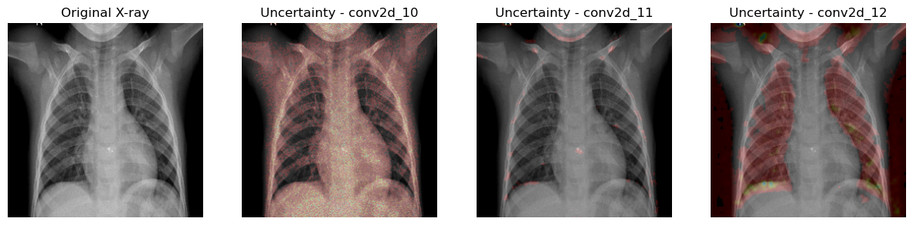
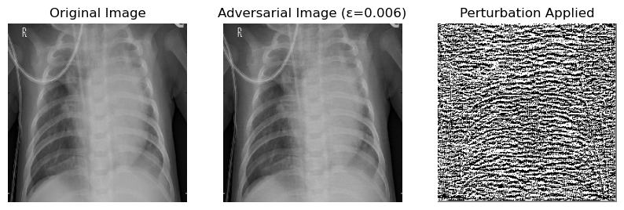
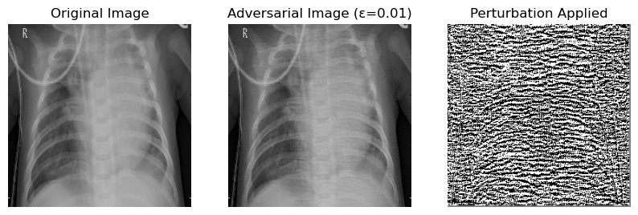

### **Motivation**

- **Clinical Importance:**  
  Pneumonia is a major cause of morbidity and mortality worldwide. Accurate and timely diagnosis through chest X-rays is critical for patient care. However, current AI systems often provide a hard prediction without indicating how confident they are.

- **Trustworthy AI:**  
  In high-stakes scenarios like medical diagnostics, understanding the uncertainty behind a prediction can be as important as the prediction itself. This project aims to incorporate Bayesian methods (via MC Dropout) into a deep learning model so that we can quantify both spatial and predictive uncertainty. This helps clinicians understand whether a high-confidence prediction should be trusted or re-examined.

- **Robustness & Interpretability:**  
  By analyzing uncertainty in both the feature maps and the final prediction, and testing the model under adversarial attacks (like FGSM), we can evaluate and improve the robustness of the model. This is vital to ensure that the system not only performs well on average but is also reliable in edge cases.

---

### **Logistics**

#### **Pretrained Model Used**
- **Model:**  
  We are using a pretrained model for pneumonia detection, such as **DenseNet-121** (or another similar architecture like CheXNet) that has been fine-tuned on chest X-ray images.
  
- **Why This Model:**  
  DenseNet-121 is known for its ability to capture detailed features through dense connectivity, making it a good candidate for medical image classification. It also integrates well with MC Dropout for uncertainty estimation.

#### **Data Source**
- **Dataset:**  
  The project uses the **ChestX-ray14** dataset provided Paul Mooney and is available on Kaagle.

- **Source:**  
  The dataset can be downloaded from :  
  [ChestXray](https://www.kaggle.com/datasets/paultimothymooney/chest-xray-pneumonia).

#### **Dataset Contents**
- **Images:**  
  Over 5863 frontal-view chest X-ray images, covering various conditions and separate sets for testing and validation.

#### **Prediction Task**
- **Objective:**  
  The goal is to detect pneumonia from chest X-ray images. In our setup:
  - **Positive Class:** Pneumonia (the presence of pneumonia).
  - **Negative Class:** Normal (absence of pneumonia) or other conditions.

---

### **Understanding MC Dropout**



*(Credits: Enhancing Deep Learning with Bayesian Inference by Dr. Matt Benatan, Jochem Gietema, Dr. Marian Schneider)*

#### **What is MC Dropout?**

- **Dropout:**  
  Dropout is traditionally used to reduce over fitting in neural network. The main idea is that by randomly turning off (setting the weights to zero) neurons in a layer we force the model to consider other ways to solve the problem. Therefore, the model is no longer dependent on just a small subset of neurons for prediction. 
  
- **MC Dropout:**  
  However, we can also use the randomness in the Dropout to induce stocasticity in the output during prediction.Thus MC Dropout is a technique that leverages dropout during inference to approximate Bayesian uncertainty.  

  - **During Training:** Dropout is used to randomly “drop” a fraction of neurons to prevent overfitting.  
  - **During Inference:** Instead of disabling dropout, we keep it active. This causes the network to produce **different predictions** for the same input, effectively sampling from a distribution over model outputs.
  
- **Why It Works:**  
  By performing multiple forward passes with dropout enabled, we obtain a set of predictions.  
  - **Mean Prediction:** Represents the final, averaged output.  
  - **Predictive Variance:** Measures the uncertainty; higher variance indicates less confidence in the prediction.

---

### **Implementation in Our Model**

To implement MC Dropout, we modify the prediction process as follows:

#### **Code Snippet: MC Dropout Inference**

```python
def mc_dropout_inference(imgs: np.ndarray, nb_inference: int, model: Sequential) -> np.ndarray:
    """
    Performs MC Dropout inference by running the model with dropout enabled for multiple forward passes.
    
    Parameters:
        imgs (np.ndarray): Preprocessed input images.
        nb_inference (int): Number of stochastic forward passes.
        model (Sequential): The pretrained pneumonia detection model.
    
    Returns:
        np.ndarray: Stacked predictions with shape (batch_size, num_classes, nb_inference).
    """
    return np.stack(
        [model(imgs, training=True) for _ in range(nb_inference)], axis=-1
    )
```

- **Explanation:**
  - We pass the image(s) through the model **nb_inference** times.
  - By setting `training=True`, dropout remains active during inference.
  - We **stack the predictions** along a new axis to later compute the mean and variance across these runs.

#### **Integration in the Pipeline:**

After obtaining the stacked predictions, we can compute the **predictive mean** and **variance** as follows:

```python
predictive_mean = np.mean(predictions, axis=-1)
predictive_variance = np.var(predictions, axis=-1)
```

- **Predictive Mean:**  
  Gives we the average prediction, which is used for the final classification decision.
  
- **Predictive Variance:**  
  Provides a measure of the model’s uncertainty. A higher variance indicates that the model's predictions are inconsistent across runs, implying less confidence.

---

### **Binned Mean vs. Variance Experiment**

After implementing MC Dropout and obtaining multiple predictions for each X-ray, we wanted to investigate **how the predictive mean (confidence) relates to the predictive variance (uncertainty)**. Specifically, we aimed to test the hypothesis:

> *“If the model is misclassifying an image, it should exhibit high variance (i.e., be unsure). Conversely, if the variance is low, the model should be correct.”*

To explore this, we grouped predictions by their **mean** into deciles (e.g., \([0, 0.1), [0.1, 0.2), \dots, [0.9, 1.0]\)) and plotted the **distribution of variance** for each bin. Below is the resulting **boxplot**, illustrating how variance changes with mean confidence.



#### **Key Observations**

1. **Overall Variance Scale is Quite Small**  
   - Even in the bins with the highest variance (around 0.4–0.6 mean predictions), the variance is only on the order of \(10^{-2}\) or \(10^{-3}\).  
   - This small range can make it challenging to distinguish between “low” and “high” uncertainty from a purely numerical standpoint, because everything looks compressed near zero.

2. **Higher Variance Around the Decision Boundary**  
   - The bins near ~0.5 mean predictions show higher variance.  
   - This is **expected behavior**: when the model is borderline between “pneumonia” and “normal,” the predictions across multiple MC Dropout runs fluctuate more.

3. **Low Variance at the Extremes (Near 0 or 1)**  
   - The first bin (0.0–0.1) and the last bin (0.9–1.0) both have **low variance**, though there is higher spread in the later case.  
   - This suggests the model is **confident** in these regions—sometimes correctly, but potentially **confidently wrong** for misclassifications.  
   - This finding challenges the idea that “all misclassifications must come with high variance.” Some errors can occur even when variance is minimal.

4. **Potential Confident Misclassifications**  
   - The observation that some **low mean** bins (i.e., the model says “not pneumonia”) still have **low variance** indicates the model can be “confidently wrong.” This is a crucial finding, as it shows that **variance alone** might not always alert us to high-risk errors.
   - This is the **most concerning type of error** because it’s both **wrong** and **confident**.  
   - Variance alone won’t always help catch high-confidence errors, so it might be beneficial to explore **additional or alternative uncertainty measures** and investigate borderline cases in more detail.

5. **Overall Magnitude of Variance**  
   - Even the “high” variance values are still quite small. This suggests that **variance alone** might not be enough to capture all forms of uncertainty—especially high-confidence errors.

#### **Conclusion**
  - The predictive variance sometimes did not correlate with misclassifications; even images correctly predicted with high confidence sometimes had similar variance levels as misclassified ones.

#### **Possible Next Steps:**  
  1. **Combine Metrics**: Consider other uncertainty measures (e.g., **predictive entropy** or **mutual information**) that might catch high-confidence misclassifications more effectively.  
  2. **Investigate Cases of Low-Variance Misclassifications**: Are these images atypical or out-of-distribution? Does the model rely on misleading features?  
  3. **Adversarial Analysis**: Check how adversarial examples affect mean/variance to see if high-confidence misclassifications can be forced or detected.
  4. **Consider a Log Scale**: If the variance is very small, plotting it on a **logarithmic scale** might make differences more visible.

---

### **Spatial Uncertainty Visualization**

#### **Motivation and Transition**

In our previous experiments, we examined the relationship between the predictive mean and variance across multiple MC Dropout runs. Our analysis revealed that predictive variance at the output level did not always correlate with misclassifications. In some cases, even images that were confidently classified (with mean predictions near 0 or 1) exhibited similarly low variance as those that were misclassified. This observation led us to question whether the uncertainty measured at the final output was capturing all the nuances of the model’s confidence.

To address this, we turned our attention to the **spatial uncertainty**—the uncertainty present in the intermediate feature maps generated by the convolutional layers during dropout. By visualizing the uncertainty at the spatial level, we can aimed to :
- **Highlight the specific regions** of an X-ray that the model finds ambiguous.
- **Investigate high-confidence images** further to determine if there are localized areas of uncertainty that might explain misclassifications.
- **Examine cases where the model is uncertain** (i.e., predictions between 0.4 and 0.6) to see if the convolutional layers provide insight into the ambiguity.

#### **Methodology**

1. **Feature Extraction with MC Dropout:**
   - We extract feature maps from selected convolutional layers (e.g., `conv2d_10`, `conv2d_11`, and `conv2d_12`) using MC Dropout. This gives us a spatial map of activations for each layer.
   - For each layer, we compute the variance across multiple stochastic forward passes. This variance serves as a proxy for the model’s uncertainty at each spatial location.

2. **Resizing and Normalization:**
   - Because different layers produce feature maps of varying resolutions, we dynamically resize the uncertainty maps to match the original image dimensions (256×256 pixels). This ensures that we can overlay them directly on the X-ray.

3. **Heatmap Generation and Overlay:**
   - We normalize the resized uncertainty map to a 0–255 range and then apply a color map (such as JET) to create a visually intuitive heatmap.
   - Finally, we overlay this heatmap on the original X-ray, highlighting regions where the model exhibits high spatial uncertainty.

---


#### **Step-by-Step Breakdown of Image Processing on the Feature Map**

**1️⃣ Extracting the Feature Maps (Uncertainty Computation)**
After running MC Dropout, we extract feature maps from different layers.  
For each convolutional layer:  
- we compute the **mean feature map** (average activation).  
- we compute the **uncertainty map** (variance across multiple MC Dropout runs).  

🔹 **Issue Here:** The variance values are usually **very small** (e.g., in the range of `0.0001` to `0.01`). These small values don't map well to an image scale (0-255).  

---

**2️⃣ Taking the Mean Across Channels**
```python
mean_uncer_map = np.mean(uncertainty_map, axis=-1)
```
- If the uncertainty map is **multi-channel** (e.g., `(H, W, C)`), this step collapses it into **a single-channel grayscale** uncertainty map of shape `(H, W)`.  
- **Effect:** Some spatial information is lost, but we now have a single uncertainty value per pixel.

---

**3️⃣ Resizing to Match Input Image**
```python
uncertainty_map_resized = cv2.resize(mean_uncer_map, (256, 256), interpolation=cv2.INTER_LINEAR)
```
  - If it’s **already 256×256**, this does nothing.
- **Effect:** Some pixel values might get interpolated, smoothing the uncertainty map.

🔹 **Potential Issue:** If feature maps are small (e.g., `60×60`), resizing **spreads out small values** over a larger image, making them even smaller.

---

**4️⃣ Normalizing the Uncertainty Map**
```python
uncertainty_map_resized = cv2.normalize(uncertainty_map_resized, None, alpha=0, beta=255, norm_type=cv2.NORM_MINMAX)
```
- **Why?** Feature values are originally **very small** (like `0.0001` to `0.01`), while image pixels need to be in the **0-255** range.
- **What Happens?**
  - The smallest uncertainty value is mapped to `0` (black).
  - The highest uncertainty value is mapped to `255` (white).
  - Everything else is **linearly scaled** between 0 and 255.

🔹 **Potential Issue:** If all values are **very close together**, normalization might not work well, making most pixels appear **the same color**.

---

**5️⃣ Applying a Binary Threshold to Highlight Uncertainty**
```python
_, binary_mask = cv2.threshold(uncertainty_map_resized, threshold, 255, cv2.THRESH_BINARY)
```
- **What Happens?**
  - Any pixel **below `threshold`** → Set to `0` (black).
  - Any pixel **above `threshold`** → Set to `255` (white).
- **Effect:** This creates a **binary mask** where only high-uncertainty areas are white.

🔹 **Potential Issue:** If `threshold` is too **high**, almost everything might be `0`, and we won't see much in the heatmap.

---

**6️⃣ Applying a Colormap (Jet Heatmap)**
```python
heatmap = cv2.applyColorMap(uncertainty_map_resized.astype(np.uint8), cv2.COLORMAP_JET)
```
- **What Happens?**
  - The grayscale uncertainty map is converted into a **color heatmap**.
  - **High uncertainty** (closer to `255`) → **Red or yellow**.
  - **Low uncertainty** (closer to `0`) → **Blue or dark colors**.

🔹 **Potential Issue:** If most values are small and normalization didn't work well, everything might get mapped to **one color (e.g., red or blue)**.

---

**7️⃣ Masking the Heatmap with High-Uncertainty Areas**
```python
masked_heatmap = cv2.bitwise_and(heatmap, binary_mask_colored)
```
- This step ensures that **only the high-uncertainty pixels** (where `binary_mask` is `255`) are kept in the final heatmap.

🔹 **Potential Issue:** If `binary_mask` is mostly black, the entire heatmap gets masked out.

---

**8️⃣ Blending the Heatmap with the Original Image**
```python
blended_image = cv2.addWeighted(img_rgb, 1 - mixing_alpha, masked_heatmap, mixing_alpha, 0)
```
- **What Happens?**
  - The **original X-ray image** is blended with the **heatmap**.
  - `mixing_alpha` controls how much of the **heatmap vs. X-ray** is visible.
  - **Higher alpha** = more heatmap, **lower alpha** = more X-ray.

🔹 **Potential Issue:** If `mixing_alpha` is too **high**, the heatmap might overpower the X-ray, making the image look mostly red.


---

### **Spatial Uncertainty Analysis on High-Confidence Predictions**

**Objective:**  
To determine whether spatial uncertainty—visualized through uncertainty heatmaps extracted from convolutional layers—can provide insights into misclassifications. In particular, we aimed to identify if the model might be "confidently wrong" by examining images that were predicted with very high confidence (e.g., a predicted probability of 0.03 for pneumonia) and then overlaying their spatial uncertainty maps.

**Methodology:**  
1. **Image Selection:**  
   - We selected a set of chest X-ray images that the model classified as normal with high confidence (predicted probability near 0.03).

**Results and Observations:**  

### 1. **prediction interval = (0.048, 0.051) -> Normal**

 



---

### 2. **prediction interval = (0.064, 0.066) -> Normal**





- **Inconclusive Patterns for the same level of predictions:**  
  - In the first example, the heatmaps showed no significant regions of uncertainty, implying that the model was uniformly confident in its prediction.
  - But in the next instances, the overlay revealed distinct red regions around the chest region(which is mainly observed to distinguish between normal and pnemonia cases) suggested localized uncertainty. This might indicate areas where the model found the image ambiguous.

- **Threshold Sensitivity:**  
  - The presence (or absence) of highlighted regions was highly sensitive to the variance threshold chosen.  
  - A lower threshold tended to flag even minor uncertainty, while a higher threshold sometimes failed to capture subtle, yet potentially critical, ambiguous regions.

**Conclusion:**  
These results indicate that spatial uncertainty visualization can be informative, but its effectiveness depends on careful calibration of the threshold used to flag high uncertainty. The fact that some high-confidence predictions (with very low mean values) also exhibited low variance suggests that the model can sometimes be confidently wrong without displaying marked spatial uncertainty. 

**Next Steps:**  
- **Parameter Tuning:** Further experiments are needed to determine robust, data-driven thresholds for flagging uncertainty.
- **Alternative Metrics:** Consider integrating additional uncertainty measures (e.g., predictive entropy or mutual information) to better capture instances where the model is confidently wrong.
- **Domain Interpretation:** Collaborate with radiologists to interpret the flagged regions and assess their clinical relevance, ultimately guiding improvements in model robustness and reliability.


---

### **Adversarial Experiments**

**Objective:**  
Showcase how MC Dropout not only provides uncertainty estimation but also imparts a degree of robustness against adversarial perturbations.

**Experiment Outline:**

1. **Adversarial Perturbation without MC Dropout:**  
   - Take a test image and apply a perturbation (using FGSM or another adversarial method) on a deterministic version of wer model (i.e., dropout disabled).
   - Record the model’s output (prediction probability) on this perturbed image.
  
2. **Adversarial Perturbation with MC Dropout:**  
   - Take the same original image, enable MC Dropout during inference, and apply the same perturbation.
   - Record the model’s output and examine the spatial uncertainty (if possible) on the perturbed image.
  
3. **Comparison and Conclusion:**  
   - **Without MC Dropout:** Expect that the adversarial perturbation will cause the model to change its prediction more dramatically.
   - **With MC Dropout:** Expect that the stochasticity from dropout will help “smooth out” the effect of the perturbation, demonstrating a level of robustness.
   - This comparison will illustrate that MC Dropout not only estimates uncertainty but also adds a measure of robustness that may help the model resist small adversarial attacks.

---

### **1. One Pixel Attack** : 
(Citation : One Pixel Attack for Fooling Deep Neural Networks Jiawei Su*, Danilo Vasconcellos Vargas* and Kouichi Sakurai)

Change the value of just one pixel in the image to filp the predictions. Just one pixel and nothing else.

How Does One-Pixel Attack Work?
1. Select a single pixel in the input image.
2. Modify its RGB (or grayscale) value within a small range.
3. Use an optimization algorithm (e.g., Differential Evolution) to find the pixel modification that maximally changes the model's prediction.
4. Measure the change in confidence and uncertainty to understand adversarial effects.


> **Differential evolution** is a stochastic population based method that is useful for global optimization problems. At each pass through the population the algorithm mutates each candidate solution by mixing with other candidate solutions to create a trial candidate.

```python
from scipy.optimize import differential_evolution

def one_pixel_attack(img, model, pixel_count=1, bounds=(0, 1)):
    
    ## several lines of code.. 
    
    return perturbed_img

# running the experiment...

original_img = img_setting(true_positive_img)
adv_img = one_pixel_attack(original_img, model, pixel_count=1)
original_pred = model.predict(original_img, verbose=0)[0][0]
adv_pred = model.predict(adv_img, verbose=0)[0][0]
print(f'No attack prediction {original_pred:.4f}')
print(f'Attack Prediction {adv_pred:.4f}')


Attack :True
No attack prediction 0.9954
Attack Prediction 0.9954

# running the experiment again with 100 pixel attack
adv_img = one_pixel_attack(original_img, model, pixel_count=100)
...

Attack :True
No attack prediction 0.9954
Attack Prediction 0.9951  # very small deviation
```

### The one pixel attack does not succeed and several reasons may be cited.
1. **The Model is Too Robust**  
   - The model may have learned strong features that are not easily disrupted by a **single pixel change**.
   - Since X-ray images contain high-level medical patterns, the model may rely on **broader spatial structures** rather than isolated pixels.

2. **The Perturbation is Too Weak**  
   - The intensity change in grayscale images (0-1 range) might not be strong enough.

3. **The Model Has Strong Spatial Invariance**  
   - CNNs are typically robust to **local pixel changes** because they use convolutional filters that generalize features across regions.
   - A **single pixel modification** may not be enough to disrupt a global decision.

4. **The Pixel Selection Might Not Be Optimal**  
   - If the chosen pixel is **not important for the decision**, modifying it won’t have a major effect.
  
5. **High Resolution Image**
   - The images used by the authors in the original paper were low resolution image, however in our case the images was high resolution. Therefore alterning one pixel does not have any noticible impact on the image.  


### **2. FGSM(Fast Gradient Sign Method) Attack**
The Fast Gradient Sign Method (FGSM) modifies the input image in the direction of the gradient to maximize the loss.

FGSM is a gradient ascent attack on the loss function, pushing the image in a direction that maximally confuses the model.

#### **1. Compute the Loss Gradient**
- Compute how the **loss** changes with respect to the **input image**

#### **2. Generate Perturbation**
- Add a small perturbation **in the direction of the gradient sign**.
- The amount of perturbation is controlled by **ε (epsilon)**

```python
import tensorflow as tf
import numpy as np
import matplotlib.pyplot as plt

def fgsm_attack(model, img, true_label, epsilon=0.007):

    ## several lines of code...

    return adversarial_img, signed_grad, img_tensor


for eps in [0.001, 0.005, 0.006, 0.007, 0.009]:
    adv_img, perturbation, ret_img = fgsm_attack(model, original_img, 1, eps)
    
    # several lines of code 
    
    plt.show()

# plotting the image and diplaying the results
```
---

**Before attack p = 0.9954; Attack Prediction 0.9896**


---
**Before attack p = 0.9954; Attack Prediction 0.8035**


---
**Before attack p = 0.9954; Attack Prediction 0.2803**


---


### **Demonstration of Robustness MC Dropout against Adversarial Attack**

```python
eps = 0.01
adv_img, perturbation, ret_img = fgsm_attack(model, original_img, 1, eps)

original_pred = model.predict(original_img, verbose=0)[0][0]
adv_pred = model.predict(adv_img, verbose=0)[0][0]
mc_dropout_pred = np.mean(mc_dropout_inference(np.array(adv_img), 100, model))

print(f'No attack prediction {original_pred*100:.4f} %')
print(f'Attack Prediction {adv_pred*100:.4f} %')
print(f'MC Dropout Prediction {mc_dropout_pred*100:.4f} %')


No attack prediction 99.5398 %
Attack Prediction 28.0334 %
MC Dropout Prediction 31.4279 %
```
In our final experiment, we compared the model's response to adversarial perturbations with and without MC Dropout enabled. When the adversarial attack was applied without MC Dropout, the model's confidence (i.e., predicted probability for the target class) was 28%. With MC Dropout activated during inference, the confidence increased modestly to 31%.

This result suggests that, in theory, MC Dropout imparts a slight robustness to adversarial perturbations. The stochasticity introduced by dropout appears to help the model "smooth" its output, resisting some of the adversarial noise that would otherwise lower its confidence.

However, the improvement—from 28% to 31%—is relatively small. In practice, such a modest enhancement may not be sufficient to rely on MC Dropout alone for protecting against adversarial attacks, especially in high-stakes domains like medical diagnosis. This indicates that while MC Dropout can contribute to a more robust model, additional strategies (such as adversarial training, better model calibration, or complementary uncertainty measures) might be necessary to achieve the level of reliability required in practice.

---

# Multi-Class Bayes Net with Uncertainty (3-4 minutes)

## Base Model

## Feature Extraction/Engineering

## Bayes Net Training

## Evaluating/Comparing Results

### Posteriors for Healthy Patient


### Posteriors for Single-Diagnosis Patient


### Posteriors for Multiple-Diagnosis Patient


### Evaluation Metrics


**std_ratio: Ratio of average standard deviation in Bayesian Credible Interval for misclassified vs. correctly classified observations. Mean Misclassified Standard Deviation / Mean Correct Standard Deviation.**

- The MAP predictions outperform the base model predictions in terms of AUC in all but one diagnosis category!
- Treating our standard deviation ratio as a measure of uncertainty, the consistent occurence of values >1 suggests that incorrect predictions are often associated with wide credible intervals, or higher uncertainty.

## Practical Applications/Future Work

- Communicating uncertainty in model predictions to physicians.
- Flagging large credible intervals.
- Proof of concept of efficient transfer learning embedding Bayesian methods.

# Conclusion (1 minute)

- As advanced deep learning models continue to be popularized in the field of radiology and medicine broadly, it is essential to be robust regarding the reliability of these model's parameters and resulting predictions due to the high stakes nature of this domain.
- On this project, we hoped to shed light on where uncertainty lies in the deployment of these models, first in the underlying feature space by visualizing areas of uncertainty in the convolutional layers of a CNN imaging diagnostic model using MCMC dropout layers, and second, in the final output layer of this model by utilizing a deep learning model as a feature extractor, to train a Bayes Net and measure the uncertainty in the final predictions.

